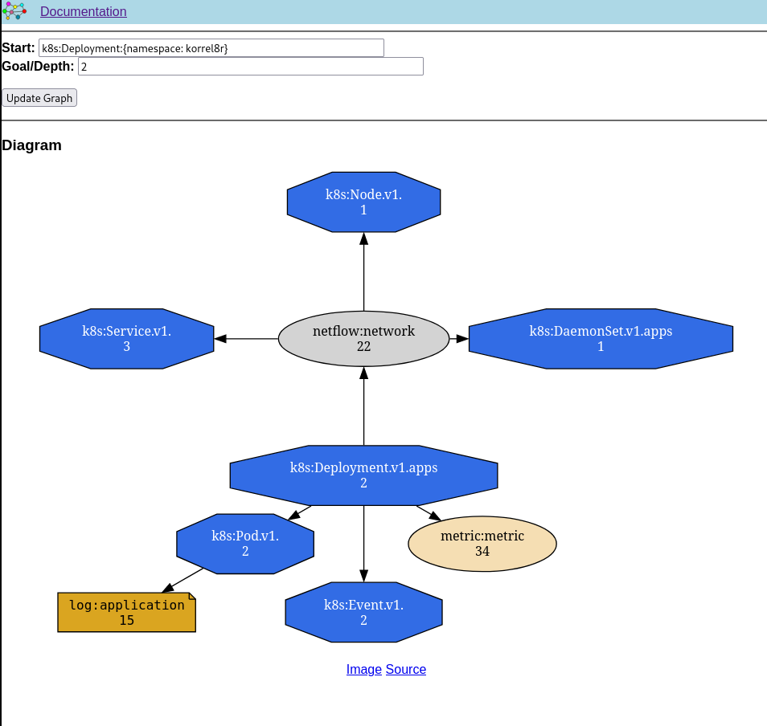

= Korrel8r User Guide
Korrel8r Project <https://github.com/korrel8r/korrel8r>
:doctype: book
:toc: left
include::attributes.adoc[]

Navigating between cluster resources and observable signals.

== Overview

Observable <<resource,resources>> produce many kinds of <<signal>> -  logs, metrics, traces, alerts and others.
Each type of signal can have its own distinct data model, naming conventions, query language, and storage.
This makes it difficult to navigate relationships between cluster resources and the signals they generate.

[NOTE]
====
The {otel} project defines a standard vocabulary for describing several types of  <<signal>>.
Korrel8r works with {otel} but does not require it. See <<_about_opentelemetry>> for more.
====

Korrel8r is a _rule based correlation engine_, with an extensible rule set, that can navigate +
↳ many types of <<signal>> and <<resource>> data +
↳ using diverse schema, data models and naming conventions +
↳ queried using diverse query languages +
↳ stored in multiple stores with diverse query APIs

Each type of <<signal>> or <<resource>> is represented by a *_<<_about_domains,domain>>_* .
Korrel8r can be extended to handle new signals and resources by adding new domains.

Relationships within and between domains are expressed as *_<<_about_rules,rules>>_*.

=== About domains

A korrel8r _domain_ represents one type of signal or resource.
Available domains are described in the <<_domain_reference>>.

Each domain defines the following abstractions, allowing Korrel8r to treat domains uniformly:

Object::
A data type representing an instance of the domain's <<signal>> or <<resource>>,
for example a log record or a serialized Kubernetes resource.
Korrel8r does not distinguish between signals and resources, they are correlated in the same way.

Store::
A service that can be queried for objects.
A domain provides one or more types of store.
Each store represents a storage service like the Kubernetes API server, Prometheus, Loki or others.

Class::
A named class of objects represented by the same data structure.
A class name is a string of the form `_domain:class_`.
Many domains have only one class, for example <<_trace_domain,trace:span>>.
Others have multiple classes. The <<_k8s_domain>> domain has a class for each kind of kubernetes resource,
for example `k8s:Pod` and `k8s:DaemonSet`

Query::
A string of the form `_domain:class:selector_` which selects a set of objects from a store.
Korrel8r does not define a query language, selectors use the native query language of the store.
For example, a <<_trace_domain>> query ussing TraceQL: +
`trace:span:{.kubernetes.namespace.name="foobar"}`

=== About rules

_Rules_ express relationships between classes, possibly in different domains.

Rules are <<_about_templates,templates>> that generate a _goal query_ using data from a _start object_.
The start and goal can be different classes, possibly from different domains.
If a rule cannot be applied to an object it may return a blank string, or raise an error.

The set of rules forms a graph connecting all the classes of data that korrel8r knows about.
Korrel8r works by traversing this graph: applying rules to some initial objects, executing the
resulting queries, retrieving more objects and so on.

There are two types of search:

Goal search::
  Given a set of _start objects_ and a _goal class_: find all paths from the start objects to objects in the _goal_ class.

Neighbourhood search::
  Given a set of _start objects_ and a depth _N_: find all objects reachable from the start objects in _N_ steps or less.

=== About OpenTelemetry

The {otel} project (OTEL) defines a standard vocabulary for  {otel-signals}[traces, metrics, and logs].
The Korrel8r <<_trace_domain>> domain uses OTEL attributes, other OTEL-based domains may be added future.

As OTEL is adopted, it will provide a more consistent vocabulary for Korrel8r rules,
but it does not replace Korrel8r:

- There are still widely-deployed systems that do not use OTEL conventions.
  Korrel8r can bridge between OTEL and non-OTEL systems.
- OTEL, by itself, does not provide any mechanism for describing or navigating relationships between signals and resources.
- OTEL does not standardize query languages or store APIs, even for OTEL-compliant systems.
- Korrel8r handles resource and signal types that are not included (yet) in the OTEL specification.
  For example <<_k8s_domain,k8s:Event>> or <<_netflow_domain,netflow:network events>>.

== Running Korrel8r

Korrel8r usually runs as a cluster service with a <<_rest_api,REST API>>.
It is used as a back-end for tools that display correlation results.
For example, the {rh-ocp} console uses Korrel8r to implement its {troubleshoopting-panel}[troubleshooting panel].

It can also be run from the command line for development and testing.

See <<_configuration>> for details of configuring Korrel8r.

[IMPORTANT]
Korrel8r uses a _Bearer Token_ to authenticate itself to stores. +
When run as a server, it impersonates the client by copying the token from the incoming REST request. +
On the command line it uses the current kubectl login, so you need to be logged in to the cluster.

=== In-cluster service

The {rh-coo} automatically installs and configures korrel8r on a {rh-ocp} cluster.

For testing and development you can also:

.Deploy the latest from github.
[source,terminal]
----
oc apply -k github.com/korrel8r/korrel8r/config/?version=main
----

.Deploy version X.Y.Z from github.
[source,terminal]
----
oc apply -k github.com/korrel8r/korrel8r/config/?version=vX.Y.Z
----

.Use community operator from OperatorHub, look for
image:images/operatorhub-tile.png[Korrel8r Community Tile]

To connect to your service from outside the cluster, you can expose it with an 'ingress' or 'route'.

.Create a korrel route on {rh-ocp}
[source,terminal]
----
oc apply -k github.com/korrel8r/korrel8r/config/route?version=main
HOST=$(oc get route/korrel8r -n korrel8r -o template={{.Spec.Host}}
----

You can use the <<_clients>> to test your service at `$HOST`.

=== Out-of-cluster service

Korrel8r can run outside the cluster, using routes or ingress URLs to connect to observability stores inside the cluster.
This can be useful for development and testing.

.Install korrel8r  command
[source,terminal,subs=attributes+]
go install github.com/korrel8r/korrel8r/cmd/korrel8r@latest

Run  `korrel8r --help` to get {korrel8r-help}[command line help].

.Download configuration for a {rh-ocp} cluster.
[source,terminal,subs=attributes+]
curl -o korrel8r.yaml  {raw-etc-korrel8r}/openshift-route.yaml

.Run as a service outside the cluster on localhost port 8080, with informational logging.
[source,terminal]
----
korrel8r -v2 --config korrel8r.yaml web --http=localhost:8080
----

See <<_clients>> for ways to test your service at `http://localhost:8080`.

=== Clients
:korrel8rcli-url: http://korrel8r.example

Once the Korrel8r service is running, there are several ways you can interact with the <<_rest_api,REST API>>.

- A purpose-built command line client <<_korrel8rcli, `korrel8rcli`>>.
- The <<_interactive_rest_api, interactive swagger API web page>> built in to Korrel8r.
- Use a generic REST request tool like {{curl}}

You can also use specialized clients like the {troubleshooting-panel}[Red Hat Openshift troubleshooting panel], or build your own.

[IMPORTANT]
====
All of the clients require a _Bearer Token_ to authenticate with the cluster. +
If you are logged in to a {rh-ocp} cluster you can find your bearer token like this:
[source.terminal]
----
oc whoami -t
----
====

==== `korrel8rcli`

`korrel8rcli` is a simple command-line client of the Korrel8r service.
It is intended for development and experimentation.
In production korrel8r normally functions as a back-end for a console or other visualization or analysis tool.

.Install korrel8rcli
[source,terminal,subs=attributes+]
----
go install github.com/korrel8r/client/cmd/korrel8rcli@latest
----

Run  `korrel8rcli --help` to get {korrel8rcli-help}[command line help].

If you are logged on to a cluster, korrel8rcli will automatically use your bearer token.
You can also specify a token explicitly with the `--bearer-token` option.

In the following examples, replace `{korrel8rcli-url}` with the URL for your korrel8r service.

===== Domains

.Get the list of domains and store status.
[source,terminal,subs=attributes+]
----
korrel8rcli -u {korrel8rcli-url} domains
----

.Example output
[source,yaml]
----
- name: alert
  stores:
  - alertmanager: https://alertmanager-main.openshift-monitoring.svc:9094
    certificateAuthority: ./run/secrets/kubernetes.io/serviceaccount/service-ca.crt
    domain: alert
    metrics: https://thanos-querier.openshift-monitoring.svc:9091
- name: k8s
  stores:
  - domain: k8s
- name: log
  stores:
  - certificateAuthority: ./run/secrets/kubernetes.io/serviceaccount/service-ca.crt
    domain: log
    lokiStack: https://logging-loki-gateway-http.openshift-logging.svc:8080
- name: metric
  stores:
  - certificateAuthority: ./run/secrets/kubernetes.io/serviceaccount/service-ca.crt
    domain: metric
    metric: https://thanos-querier.openshift-monitoring.svc:9091
- name: mock
  stores: null
- name: netflow
  stores:
  - certificateAuthority: ./run/secrets/kubernetes.io/serviceaccount/service-ca.crt
    domain: netflow
    lokiStack: https://loki-gateway-http.netobserv.svc:8080
----

===== Neighbours

.Get the neighbours graph of the korreler deployment
[source,terminal,subs=attributes+]
----
korrel8rcli -o json neighbours {korrel8rcli-url} --query 'k8s:Deployment:{namespace: korrel8r}'
----

.Output is a JSON-encoded graph.
[source,json]
----
{"edges":[{"goal":"k8s:Pod/v1","start":"k8s:Deployment.apps/v1"},...
 "nodes":[{"class":"log:application","count":15,"queries":[...
----

===== Web browser

CAUTION: This tool is experimental, it may change or be dropped in future.

.Run a web server to vizualize results.
[source,terminal,subs=attributes+]
----
korrel8rcli web -u {korrel8rcli-url} --addr :9090
----

.View results in a browser.
Open `localhost:9090` in a web browser.
You can type a korrel8r query in the `Start` box, and a numeric depth (for neighbours) or korrel8r class name (for goal search).
You should see a graph of the correlations, like this.

.Example graph.

==== Interactive REST API

Korrel8r provides an interactive REST API page using swagger.
This page documents the REST API, and allows you to make interactive calls.

Browse to `http://korrel8r.example/swagger` to use the page.

// TODO how do you provide a bearer token in the browser case?

====  Using curl

You can use a generic REST client like {{curl}} to interact with korrel8r.
You can use the <<_interactive_rest_api>> page to discover the right `curl commands`.
When you execute a call interactively on this page, it will show you the corresponding curl command.

You must provide a bearer token, for example:

[source,terminal]
----
curl --oauth2-bearer $(oc whoami -t) http://localhost:8080/api/v1alpha1/domains
----

==== Red Hat Openshift troubleshooting panel

The {rh-ocp} console has a {troubleshooting-panel}["troubleshooting panel"] that is powered by Korrel8r.
This is a good example of how korrel8r is intended to be used,
as a back-end to compute correlations for other tools that visualize the results.

=== Troubleshooting

[TIP]
====
You can increase the verbosity of korrel8r logging at run time using the
xref:gen/rest_api.adoc#id-put-config[`config` API].
====
.Using korrel8rcli
[source,terminal,subs=attributes+]
----
korrel8rcli config --set-verbose=9
----

.Using curl
[source,terminal]
----
curl --oauth2-bearer $(oc whoami -t) -X PUT http://localhost:8080/api/v1alpha1/config?verbose=9
----

== Configuration

Korrel8r loads configuration from a file or URL specified by the `--config` option:

[source,terminal]
----
korrel8r --config <file_or_url>
----

The {project}[Korrel8r project] provides link:{etc-korrel8r}[example configuration files].
You can download them or use them directly via URL.

link:{raw-etc-korrel8r}/openshift-route.yaml[openshift-route.yaml]::
Run korrel8r outside the cluster, connect to stores via routes:

link:{raw-etc-korrel8r}/openshift-svc.yaml[openshift-svc.yaml]::
Used to run korrel8r as an <<_in_cluster_service>>, connect to stores via service URLs.

The configuration is a YAML file with the following sections:

=== include

.Other configuration fragments to include.
[source,yaml]
----
include:
  - "path_or_url"
----

=== stores

.Connections to data stores.
[source,yaml]
----
stores:
  - domain: "domain_name" <1>
    # Domain-specific fields <2>
----

<1> Domain name of the store (required).
<2> Domain-specific fields for connection parameters. See <<_domain_reference>>.

Every entry in the `stores` section has a `domain` field to identify the domain.
Other fields depend on the domain, see <<_domain_reference>>.

Store fields may contain <<_about_templates,templates>> that expand to URLs.

[source,yaml]
.Example: configuring a store URL from an Openshift Route resource.
----
stores:
  - domain: log
    lokiStack: <-
      {{$r := get "k8s:Route.route.openshift.io/v1:{namespace: openshift-logging, name: logging-loki}" -}} <1>
      https://{{ (first $r).Spec.Host -}} <2>
----

<1> Get a list of routes in "openshift-logging" named "logging-loki".
<2> Use the .Spec.Host field of the first route as the host for the store URL.

=== rules

.Rules to relate different classes of data.
[source,yaml]
----
rules:
  - name: "rule_name" <1>
    start: <2>
      domain: "domain_name"
      classes:
        - "class_name"
    goal: <3>
      domain: "domain_name"
      classes:
        - "class_name"
    result:
      query: "query_template" <4>
----

<1> Name identifies the rule in graphs and for debugging.
<2> Start objects for this rule must belong to one of the `classes` in the `domain`.
<3> Goal queries generated by this rule may must retrieve one of the `classes` in the `domain`.
<4> Result queries are generated by executing the query {go-template}` with the start object as context.

Korrel8r comes with a comprehensive set of rules by default, but you can modify them or add your own.

A rule has the following key elements:

* A set of _start_ classes. The rule can apply to objects belonging to one of these classes.
* A set of _goal_ classes. The rule can generate queries for any of these classes.
* A Go template to generate a goal query from a start object.

The query template should generate a string of the form:

----
<domain-name>:<class-name>:<query-details>
----

The _query-details_ part depends on the domain, see <<_domain_reference>>

// TODO: Examples

=== aliases

.Short-hand alias names for groups of classes.
[source,yaml]
----
aliases:
  - name: "alias_name" <1>
    domain: "domain_name" <2>
    classes: <3>
      - "class_name"
----

<1> Alias name can be used in rule definitions wherever a class name is allowed.
<2> Domain for classes in this alias.
<3> Classes belonging to this alias.

=== About Templates

Korrel8r rules and store configuration can include {go-templates}.

[TIP]
This is the same templat syntax as the `kubectl` command with the `--output=template` option.

Korrel8r provides additional _template functions_ to simplify writing rules and configurations:

- The {sprig} library of general purpose template functions is always available.
- Some domains (for example the <<_k8s_domain>>) provide domain-specific functions, see the <<_domain_reference>>.
- The following function is available for store configurations:
  query::
    Takes a single argument, a korrel8r query string.
    Executes the query and returns the result as a `[]any`.
    May return an error.
+
.Example: Query the k8s cluster for a route, extract the "host" field.
----
{{(query "k8s:Route.route.openshift.io:{namespace: netobserv, name: loki}" | first).spec.host}}
----

// TODO: automate the above, get this from pkg/engine doc comments.

== Domain Reference

Reference details for the for the classes, objects, queries and stores of each available domain.

include::gen/domains.adoc[leveloffset=+2]

include::gen/rest_api.adoc[leveloffset=+1]

[glossary]
= Glossary

include::glossary.adoc[]
