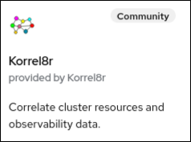

include::attributes.adoc[]
[id="installing-korrel8r-ocp"]
= Installing {operator} on {rh-ocp}

.Prerequisites

* You have administrator permissions on an {rh-ocp} cluster version 4.12 or newer.
* You have installed the https://docs.openshift.com/container-platform/latest/logging/cluster-logging-deploying.html[Red Hat OpenShift Logging Operator] version 5.8.1 or newer provided by {red-hat}.
* You have installed the https://docs.openshift.com/container-platform/latest/logging/log_storage/installing-log-storage.html#logging-loki-gui-install_installing-log-storage[Loki Operator] version 5.8.1 or newer provided by {red-hat}, and have created a `LokiStack` custom resource (CR).
* You have https://docs.openshift.com/container-platform/latest/logging/cluster-logging-deploying.html#configuring-log-storage-cr_cluster-logging-deploying[created a `ClusterLogging` CR] that configures LokiStack as the log store.

.Procedure

. In the {rh-console} go to `Home > Console > Operators > OperatorHub`
. Type "korrel8r" in the filter box and select the Korrel8r Community tile +
  
. Click Install, Install again, and you are done!

NOTE: By default the operator is installed in namespace `openshift-operators`. +
You can change this during install.

You can now create a "Korrel8r" instance in any namespace.

NOTE: A Korrel8r instance with no additional configuration will connect to default signal stores for  {rh-ocp}, and integrate with the {rh-console}.
You can xref:configuring-korrel8r.adoc#configuring-korrel8r[customize the configuration] to use alternate stores.
